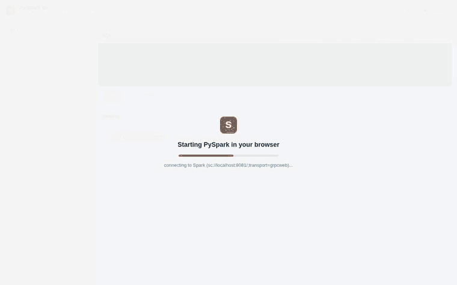

<!-- SPDX-License-Identifier: Apache-2.0 -->

# Embedded BI query cell (demo)

A small, product-style BI page that uses **pyspark-connect-web** as a live query
cell: pick a table, write SQL, see results. The real PySpark Connect client runs
in the browser (Pyodide) and talks to a remote Spark Connect server over
grpc-web. No JVM, no `pip install pyspark`, no client setup.



> Recorded in CI ([`tests/e2e/demo.spec.ts`](https://github.com/HyukjinKwon/pyspark-client-wasm/blob/main/tests/e2e/demo.spec.ts))
> against a real Spark Connect server: PySpark boots in the browser tab, then
> picks a table, runs SQL, and renders results.

Source: [`demo/`](https://github.com/HyukjinKwon/pyspark-client-wasm/tree/main/demo)
(see [`demo/README.md`](https://github.com/HyukjinKwon/pyspark-client-wasm/blob/main/demo/README.md)).

## What it does

- **Picks a table**: a synthetic retail dataset (`customers`, `products`,
  `orders`) shown in a sidebar.
- **Shows schema** for the selected table.
- **Runs your SQL**: `spark.sql(...).toPandas()` over the blocking SAB/Atomics
  bridge, rendered as a result grid (first 1000 rows).
- **Ships example analytics queries**: top products by revenue, revenue by
  country, monthly revenue, top customers.

It is the same boot path as the standalone harness (a module Web Worker running
`worker_bootstrap.js` plus the `bridge.js` blocking transport), with a BI UI
layered on top of `window.__pcwRunPython`.

## How the data works

The retail dataset is defined as deterministic CTEs (seeded `pmod` arithmetic)
that are injected into every query, so every statement sent to Spark is a
data-returning `SELECT` (no DDL). The same dataset appears for every visitor,
with no warehouse writes, and it works on any Spark Connect server. These exact
queries are regression-tested against a live Spark Connect server in
[`tests/integration/test_demo_queries.py`](https://github.com/HyukjinKwon/pyspark-client-wasm/blob/main/tests/integration/test_demo_queries.py)
(the cheap `ci.yml` integration job, no browser), and the page itself is driven
end to end in a real browser by the e2e workflow.

## Run it

You need Docker (for the Spark Connect server and Envoy proxy) and the
site-build toolchain.

```bash
# 1. Build the JupyterLite site and stage the demo into it at /demo/
scripts/build_demo_site.sh

# 2. Bring up Spark Connect 4.x + Envoy grpc-web + the static host
docker compose -f deploy/compose.yaml up
#    wait for "pcw-spark-connect" to report healthy (about 60s cold start)

# 3. Open the cross-origin-isolated page
open http://localhost:8000/demo/
```

First load spends about 15 to 30 seconds booting Pyodide and installing the
PySpark wheels in the browser; after that it is interactive. Point it at a
different backend with `?remote=`, for example
`http://localhost:8000/demo/?remote=sc://myhost:8081/;transport=grpcweb`.

## Why it must be served by Envoy, not opened from disk

The blocking bridge uses `SharedArrayBuffer` and `Atomics.wait`, which require a
cross-origin-isolated page (`Cross-Origin-Opener-Policy: same-origin` plus
`Cross-Origin-Embedder-Policy: credentialless`). The deploy Envoy sets those
headers and serves the same-origin `/worker/`, `/pyodide/` and `*.whl` assets the
page loads, which is why the demo lives under the built site rather than being
opened from the filesystem.
