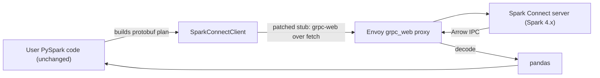

<!-- SPDX-License-Identifier: Apache-2.0 -->

# pyspark-connect-web - PySpark in JupyterLite

Run the **real** PySpark Connect Python client inside a browser
(JupyterLite/Pyodide), talking to a Spark Connect server through a grpc-web
transport. Your existing PySpark code runs unchanged - no reimplementation, no
local JVM, no Python backend server.

```python
import pyspark_connect_web as pcw
pcw.install()

from pyspark.sql import SparkSession
spark = SparkSession.builder.remote("sc://localhost:8081/;transport=grpcweb").getOrCreate()
spark.range(10).filter("id % 2 = 0").toPandas()   # runs in your browser tab
```

## A thin client, not local compute

**This is a thin client, not local compute.** PySpark's Connect client is pure
Python above a single gRPC stub: it builds protobuf plans and ships them to the
server. We **monkey-patch only that stub** with a grpc-web/`fetch` transport, and
make calls blocking via a Web Worker + `Atomics`/`SharedArrayBuffer` bridge so
`.collect()` returns data synchronously. Everything above the stub - DataFrame,
Column, functions - is untouched.

You still need a running Spark Connect server (Spark 4.x) behind an Envoy
grpc-web proxy. The browser does **not** run Spark; it builds plans and renders
results. The win is: no Python *backend*, the real PySpark API, anywhere a
browser runs.



## Where to go next

| If you want to... | Read |
|---|---|
| Install the package into a browser/JupyterLite env | [Installation](installation.md) |
| Run a query end-to-end as fast as possible | [Quickstart](quickstart.md) |
| Bring up Spark Connect + Envoy on your laptop | [Running locally](running-locally.md) |
| Understand `sc://`, TLS, and auth | [Connection patterns](connection-patterns.md) |
| Host the JupyterLite site (GitHub Pages, Netlify, ...) | [JupyterLite hosting](jupyterlite-hosting.md) |
| Understand the internals | [Architecture](architecture.md) |
| Deploy past localhost safely | [Security](security.md) |
| Look up the public API | [API reference](api-reference.md) |

## Status

Early development. The server side (`deploy/`) and the e2e scaffold
(`tests/e2e/`) are in place; the browser client and the JupyterLite build are in
progress. See `CONTRIBUTING.md` in the repository for the build plan and
`the design notes` for the load-bearing invariants.

## License

Apache-2.0. "Apache Spark", "Spark", and "PySpark" are trademarks of the Apache
Software Foundation, used here only to describe interoperability.
